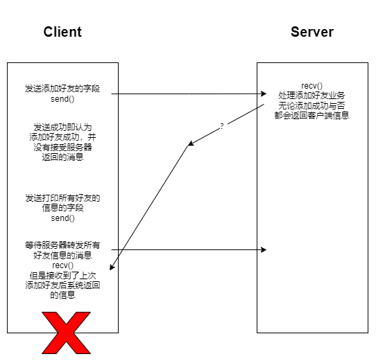
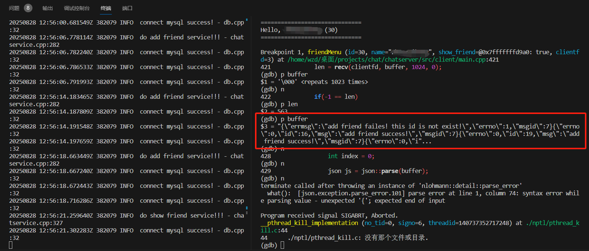
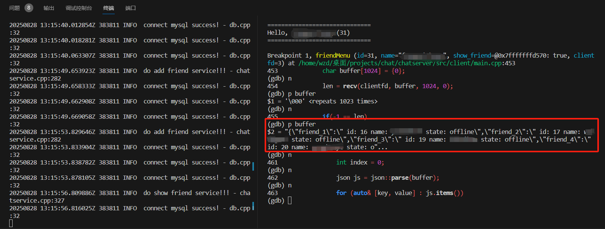

# chatserver
基于muduo，mysql，redis，nginx等的集群聊天服务器，包括单对单聊天，群聊，添加好友，添加群聊等功能

## 更新内容
1. 2025.8.28
    修复了用户连续添加好友后打开好友列表出错的问题

    ————添加好友后服务器向客户端发送消息反馈(send)，但是客户端没有对应的接受(recv)，导致客户端在接下来
        recv等待服务器返回好友列表信息时，得到的添加好友消息的反馈信信息。

    

    在gdb中复现错误情况：

    

    修改后的结果：
    