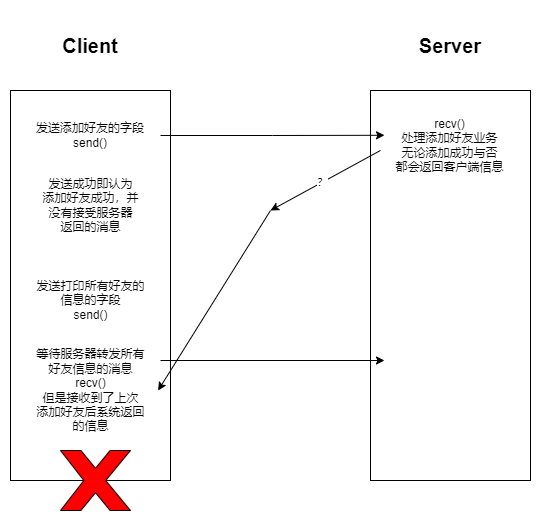
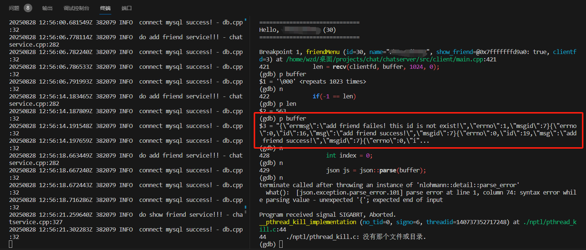
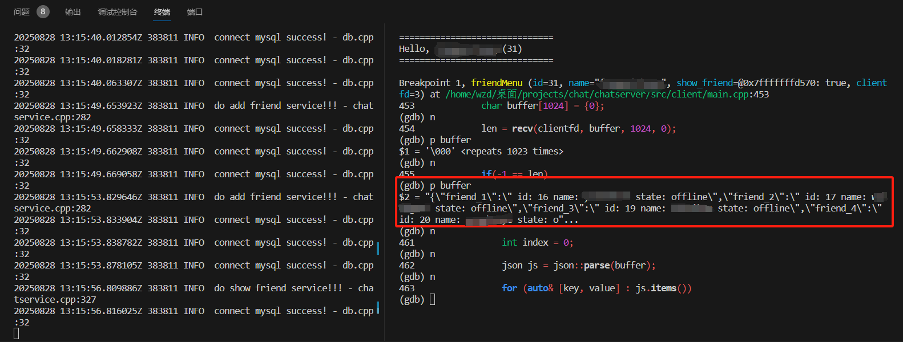
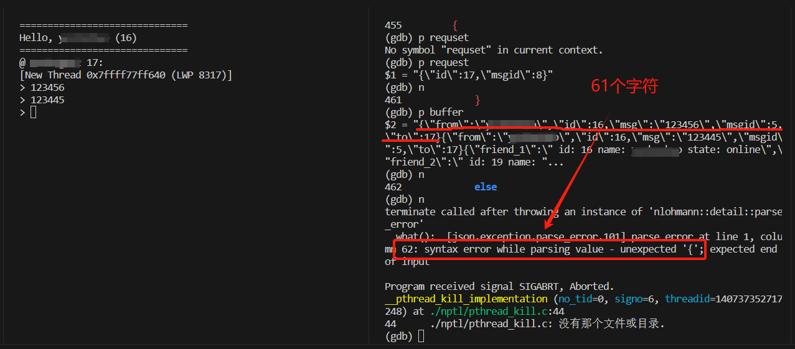
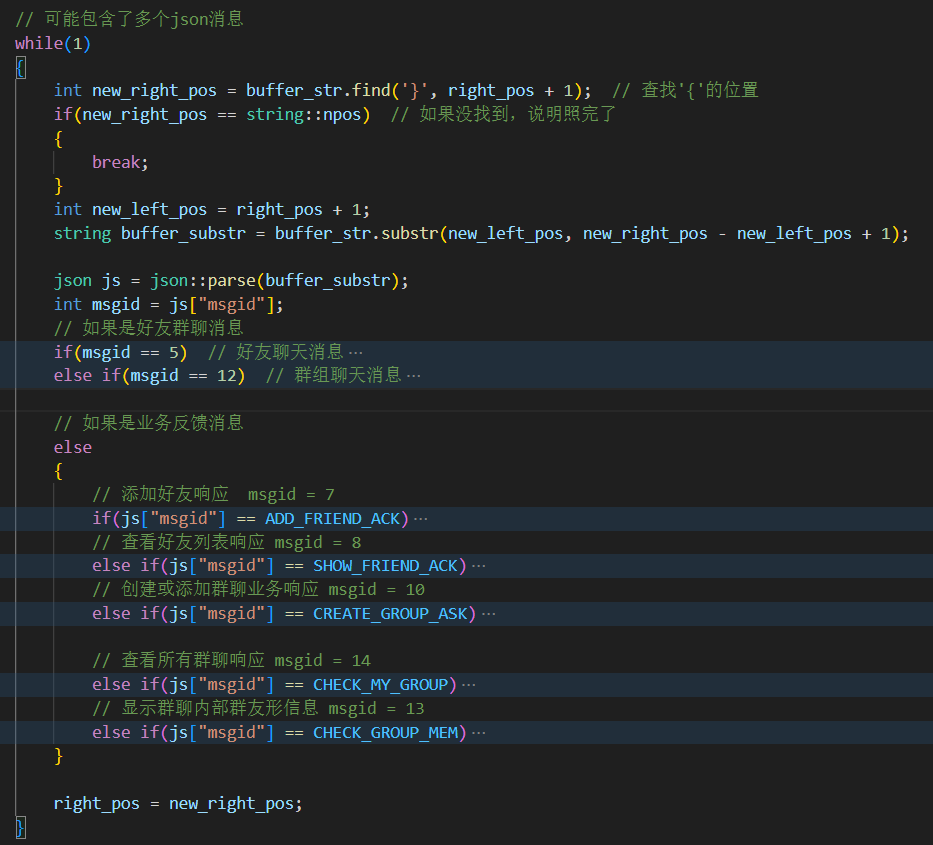

# chatserver
基于muduo，mysql，redis，nginx等的集群聊天服务器，包括单对单聊天，群聊，添加好友，添加群聊等功能

## 更新内容
1. 2025.8.28
    修复了用户连续添加好友后打开好友列表出错的问题

    ————添加好友后服务器向客户端发送消息反馈(send)，但是客户端没有对应的接受(recv)，导致客户端在接下来
        recv等待服务器返回好友列表信息时，得到的添加好友消息的反馈信信息。

    

    在gdb中复现错误情况：

    

    修改后的结果：

    

2. 2025.9.2
    修复了非聊天页面下收到聊天消息与其他消息的冲突

    
    ————当用户登录后，如果有其他用户发来消息，然后该用户去查看好友列表，这时recv会接收到好友发来的消息和服务器返回的好友列表的json串的合并，于是在反序列化的时候就会出错。也可能出现当用户登陆后，如果有其他用户发来消息，那么此时查看好友列表得到的可能什么都没有，即使他有好友，之后的查看或者刷新后就没有错。

    在gdb中复现错误情况：

    

    ————同时，由于原先分别为单人聊天和群聊设置了一个独立线程接收对应的聊天消息，会导致处在登陆状态，但没有处于聊天窗口时发送的消息无法及时接收到，因为没有对应的recv；不仅如此，在某个好友聊天页面可能出现其他好友发来的消息。

    为此，设计一个独立的消息接受线程，在用户登录后即开启，它包含唯一的recv，保证send和recv之间不会混乱。
    用户在登陆状态下，如果有人/群聊发来消息，且此时用户处在与该人/群聊的聊天页面上，就直接显示页面
    否则，就把消息存放到一个暂存的队列中，当打开对应的聊天页面时，这些消息就会优先显示出来。

    同时，针对json串可能合并的情况，通过循环将被合并接收的json串拆分开。

    

3. 2025.9.4 
    修复了离线消息和在线状态下的非窗口消息的一些问题，具体来说：

    a. 修复了离线消息不能存储的问题

    b. 实现了退出登录后将非窗口消息转发到offlinemessage中

    ————虽然在线状态下的非窗口消息可以被接收到，但是如果不去打开这个对应的窗口，退出登录后这些消息就消失了。

    ~~直接将离线消息加载到第2点提到的暂存队列中，这时数据库里的消息肯定要清理掉，但如果用户不打开对应的聊天窗口后下线，这些消息就消失了。~~

    ~~在把非窗口消息打印出来的上一步，向服务器发送请求，等待接收线程处理，但是可能面临一种情况：登录前接收到消息1，为离线消息，登录后不打开对应的聊天窗口接收到消息2，为非窗口消息，退出登录后又接收到消息3，为离线消息。下次登录时候进入聊天窗口，先输出离线消息1和3~~

    退出登录前把非窗口消息全部加载到offlinemessage上。理论上可行，并且不会导致时间顺序的问题，(但是用户消息全部存储在了服务器上（不过历史消息也不回被存取），另外用户无法使用offlinemessagemodel，只能将所有的非窗口消息全部发送给服务器，让服务器去处理)。
    在打开聊天窗口，打印非窗口消息之前将离线消息从offlinemessage中读出，也不能放入非窗口消息队列中，这样会打乱时间顺序。(同时，离线消息在offlinemessage中只存储了userid和message，无法直接定位到对应好友或者对应群聊的消息，并且删除消息也只能根据userid把全部的删除)

    ~~删除问题可以通过同时指定userid和message来从数据库中删除指定的记录，即使是出现了userid一样且message也一样的消息，那也表明了是来自同一个群聊或者好友的消息，是应该被删除的~~
    干脆一点，直接修改offlinemessage的表的结构：
    ```mysql
        mysql> desc offlinemessage_v2;
        +----------+--------------+------+-----+---------+-------+
        | Field    | Type         | Null | Key | Default | Extra |
        +----------+--------------+------+-----+---------+-------+
        | userid   | int          | NO   |     | NULL    |       |
        | friendid | int          | NO   |     | NULL    |       |
        | groupid  | int          | NO   |     | NULL    |       |
        | message  | varchar(500) | NO   |     | NULL    |       |
        +----------+--------------+------+-----+---------+-------+  
    ```
    friendid和groupid里面有且只有一个是-1，表示是另外一种来源。

4. 2025.9.5
    修复了添加好友, 添加群聊和创建群聊发生异常阻塞的问题


    
    


    